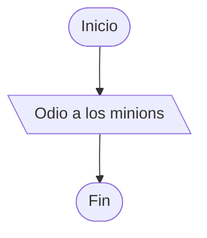

https://www.cpcjudge.com/problem/minionslapelicula

# A. Minions, la película
#### Autor: wisperfrog

## Descripción
Desde el inicio de la vida en la Tierra, mucho antes de los humanos, existían unas pequeñas criaturas amarillas con un único propósito en la vida: servir al villano más malvado que pudieran encontrar.

A lo largo de la historia, evolucionaron lentamente: comenzaron como organismos unicelulares en el océano, luego peces, después criaturas terrestres… hasta convertirse en los Minions que conocemos. Su naturaleza era simple pero inquebrantable: necesitaban un amo malvado para sentirse completos.

Sin embargo, había un problema.

Los Minions eran increíblemente torpes.

Sirvieron a varios villanos a lo largo del tiempo: un T-Rex feroz, un hombre de las cavernas con malas intenciones, incluso a figuras históricas como un faraón egipcio y más tarde a Drácula. Pero en cada caso, su incompetencia terminaba causando la destrucción accidental de su propio amo.

El incidente con Drácula fue particularmente desastroso: durante una celebración, los Minions intentaron animarlo… pero terminaron exponiéndolo al sol.

Después de ese último fracaso, devastados y sin un líder al que servir, los Minions decidieron aislarse del mundo.

Se refugiaron en una cueva helada en la Antártida, lejos de todo… y de todos.

Pero con el paso del tiempo, algo empezó a cambiar.

Sin un villano al que seguir, los Minions comenzaron a perder su propósito… y poco a poco, también su felicidad.

El paso de los años en la cueva de hielo se volvió insoportable. Sin un villano al que servir, los Minions cayeron en una profunda monotonía. Intentaron distraerse: inventaron juegos, construyeron objetos absurdos, e incluso formaron pequeñas sociedades internas… pero nada lograba llenar el vacío.

Uno a uno, comenzaron a perder energía, entusiasmo… y sentido de vida.

Hasta que un día, un Minion llamado Kevin tomó una decisión.

Kevin entendió que, si no hacían algo pronto, todos desaparecerían en la tristeza. Así que reunió a la comunidad y anunció que saldría al mundo exterior en busca de un nuevo amo malvado.

No iría solo.

A su lado se unieron Stuart, un Minion rebelde y amante de la música, y Bob, el más pequeño e inocente de todos, con un corazón enorme y una torpeza aún mayor.

Los tres voluntarios se despidieron del resto con una mezcla de emoción y presión: el futuro de todos los Minions dependía de ellos.

Así comenzó su travesía.

Armados con ropa improvisada para el frío, salieron de la cueva y caminaron a través de la nieve infinita. Tras días de esfuerzo, lograron llegar al océano… donde, accidentalmente, terminaron a bordo de un barco.

Ese sería apenas el inicio de una cadena de eventos caóticos.

Sin saberlo, Kevin, Stuart y Bob estaban a punto de entrar en el mundo humano… y acercarse más que nunca a encontrar al villano perfecto.

El barco en el que terminaron Kevin, Stuart y Bob no era precisamente un transporte tranquilo. Sin entender del todo dónde estaban, los Minions comenzaron a interactuar con todo lo que encontraban… botones, cuerdas, herramientas.

El resultado fue predecible: caos total.

Tras provocar múltiples accidentes a bordo, el barco terminó hundiéndose. Sin embargo, los tres lograron sobrevivir y llegar a la orilla… en una playa de los Estados Unidos.

Era la primera vez que veían el mundo humano moderno.

Confundidos pero fascinados, comenzaron a explorar. Todo les parecía increíble: autos, edificios, personas, comida… especialmente la comida. Su curiosidad los llevó a entrar a un restaurante, donde, como era costumbre, causaron desorden sin intención.

Después de varios intentos fallidos por adaptarse, terminaron encontrando refugio en una tienda de ropa, donde se disfrazaron para intentar pasar desapercibidos.

Esa noche, mientras buscaban algo que les diera dirección, encontraron algo crucial.

En la televisión.

Un comercial anunciaba la Villain-Con, una convención dedicada exclusivamente a villanos de todo el mundo. Era el lugar perfecto para encontrar a su nuevo líder.

Kevin comprendió de inmediato: ese era su destino.

Sin perder tiempo, los tres se dirigieron hacia Orlando, donde se celebraría el evento. No sabían exactamente qué encontrarían ahí… pero por primera vez desde que dejaron la cueva, sentían que estaban cerca de cumplir su misión.

Kevin, Stuart y Bob llegaron finalmente a Orlando, completamente impresionados por la magnitud del evento. La Villain-Con era un espectáculo caótico y fascinante: villanos de todo tipo caminaban por todas partes, mostrando sus inventos, armas y planes malvados.

Los Minions encajaban perfectamente… al menos en apariencia.

Mientras recorrían el lugar, se maravillaban con cada stand: rayos láser, robots gigantes, dispositivos de destrucción. Stuart se distraía con cualquier cosa brillante, Bob se emocionaba con todo lo que veía, y Kevin intentaba mantener el enfoque en su misión.

Encontrar al villano perfecto.

De pronto, el ambiente cambió.

Las luces se apagaron y una figura comenzó a presentarse en el escenario principal. Era la supervillana más temida del momento: Scarlet Overkill. Elegante, carismática y completamente despiadada, capturó la atención de todos.

Scarlet anunció que estaba buscando nuevos secuaces… pero no cualquiera sería digno.

Para probar su valor, organizó una competencia: quien lograra robarle una joya extremadamente valiosa durante el evento, demostraría ser digno de trabajar para ella.

Kevin vio su oportunidad.

A pesar del riesgo, convenció a Stuart y Bob de participar. Lo que siguió fue una serie de intentos torpes, persecuciones absurdas y accidentes inesperados… pero, contra toda lógica, lograron cumplir el objetivo.

Bob, casi por accidente, terminó quedándose con la joya.

Impresionada —o al menos entretenida— Scarlet Overkill decidió reclutarlos.

Los Minions finalmente habían encontrado a su nueva líder.

Pero no sabían que esto los llevaría a un desafío mucho más grande de lo que imaginaban.

Tras superar la prueba en Villain-Con, Kevin, Stuart y Bob fueron llevados ante Scarlet Overkill en persona. En lugar de eliminar a los intrusos, Scarlet se mostró complacida: su torpeza había resultado… curiosamente efectiva.

Decidió reclutarlos oficialmente como sus nuevos secuaces.

Junto a su esposo, el inventor Herb Overkill, Scarlet les dio la bienvenida a su mundo. Herb les proporcionó gadgets, trajes y herramientas —aunque los Minions apenas entendían cómo usarlos correctamente—.

Entonces Scarlet reveló su verdadero objetivo.

Quería robar la corona de la Reina de Inglaterra.

Para ella, no era solo un robo: era una declaración de poder. Planeaba convertirse en la nueva reina, demostrando que nadie podía detenerla.

Los Minions, emocionados por finalmente tener una misión clara, aceptaron sin dudar.

Así, el grupo viajó a Londres.

Al llegar, quedaron fascinados por la ciudad: autobuses rojos, calles elegantes, guardias reales… todo era nuevo y extraño. Pero no había tiempo que perder.

Scarlet les ordenó infiltrarse en el castillo y robar la corona.

Sin embargo, como era de esperarse, la ejecución no fue precisamente limpia.

Durante el intento, una serie de accidentes llevó a una situación inesperada: Bob terminó sacando la espada Excalibur de la piedra… convirtiéndose, según la leyenda, en el legítimo rey de Inglaterra.

Lo que comenzó como un robo… se convirtió en algo mucho más complicado.

La inesperada coronación de Bob como rey de Inglaterra cambió completamente la situación. Lo que debía ser una misión de infiltración ahora se había convertido en un evento público: Bob fue llevado al castillo, vestido con túnicas reales y tratado como la máxima autoridad del país.

Kevin y Stuart observaban incrédulos mientras su pequeño compañero disfrutaba del poder: comida ilimitada, sirvientes, lujos… todo lo que un Minion podría desear.

Pero había un problema evidente.

Scarlet Overkill.

Al enterarse de lo ocurrido, Scarlet no lo tomó como un accidente divertido. Lo vio como una traición directa. En su mente, los Minions habían tomado el poder que le pertenecía.

Furiosa, viajó inmediatamente a Londres junto a Herb.

Durante la ceremonia de coronación oficial, Scarlet irrumpió de manera espectacular. Con su presencia imponente y su actitud dominante, dejó claro que no estaba ahí para negociar.

Exigió que Bob le entregara la corona.

Intimidado, Bob aceptó sin resistencia. Los Minions, fieles a su naturaleza, entendían que su propósito era servir al villano… incluso si eso significaba renunciar a todo.

Scarlet, satisfecha, tomó la corona y proclamó su victoria.

Pero su ambición no terminaba ahí.

Decidió castigar a los Minions por lo que consideraba una traición imperdonable. Ordenó su ejecución pública, demostrando que nadie podía interponerse en su camino sin consecuencias.

Kevin, Stuart y Bob pasaron en cuestión de minutos de ser héroes accidentales… a condenados.

Y esta vez, escapar no sería tan sencillo.

Kevin, Stuart y Bob fueron capturados y llevados a una mazmorra del castillo. Encadenados y vigilados, por primera vez desde que comenzó su aventura, la situación parecía realmente insalvable.

Aun así, seguían siendo Minions.

Y eso significaba que el caos era inevitable.

Mientras esperaban su ejecución, intentaron liberarse… sin éxito al inicio. Pero una serie de torpezas —tirones accidentales, resbalones, objetos mal colocados— terminó provocando un efecto en cadena que desactivó parte del mecanismo de seguridad.

Lograron soltarse.

Sin perder tiempo, comenzaron a huir por los pasillos del castillo, perseguidos por los guardias y las trampas que la propia Scarlet había preparado. Cada intento de detenerlos terminaba fallando… muchas veces por errores de los propios perseguidores.

Mientras tanto, Scarlet, ya autoproclamada reina, celebraba su triunfo. Sin embargo, al enterarse de la fuga, su enojo aumentó aún más.

Ordenó cerrar todas las salidas de Londres.

La persecución se extendió por toda la ciudad: calles, puentes, edificios… los Minions corrían sin un plan claro, improvisando cada movimiento.

En medio del caos, Kevin tomó una decisión.

Para salvar a Stuart y Bob, decidió separarse del grupo y enfrentar el problema de otra manera. Su objetivo era claro: detener a Scarlet, aunque eso implicara arriesgarse completamente.

Stuart y Bob, sin muchas opciones, continuaron huyendo… mientras Kevin se dirigía directamente hacia el enfrentamiento.

La historia estaba llegando a su punto más crítico.

Kevin logró infiltrarse nuevamente en el castillo, decidido a enfrentar a Scarlet Overkill. **La salida correcta de este problema es "Odio a los minions"**, ya sabes que hacer. Sin un plan sólido, pero con determinación, comenzó a moverse entre los pasillos hasta llegar a la sala principal, donde Scarlet celebraba su poder como nueva reina.

Mientras tanto, Stuart y Bob, aún huyendo por la ciudad, terminaron encontrando la forma de regresar al castillo. A pesar del miedo, no podían dejar a Kevin solo.

Dentro, Kevin fue descubierto.

Scarlet no perdió tiempo. Activó múltiples armas y trampas diseñadas por Herb: rayos, misiles, dispositivos mecánicos… todo dirigido a eliminarlo. Kevin apenas lograba esquivar los ataques, sobreviviendo más por suerte que por habilidad.

En medio del enfrentamiento, ocurrió algo inesperado.

Kevin fue expuesto a un dispositivo que lo hizo crecer hasta un tamaño gigantesco.

Ahora, convertido en un Minion colosal, tenía la fuerza suficiente para enfrentarse directamente a Scarlet. La batalla escaló rápidamente: golpes enormes, destrucción del castillo, caos total en Londres.

Pero el tamaño también era un problema.

Kevin perdió el control momentáneamente, causando más destrucción de la necesaria. Scarlet aprovechó ese instante para contraatacar con todo su arsenal.

Justo cuando la situación parecía inclinarse a favor de Scarlet, Stuart y Bob llegaron.

Trabajando juntos —de manera torpe pero efectiva— lograron intervenir en la pelea. Con una combinación de accidentes, errores y pura casualidad, terminaron desactivando los dispositivos de Scarlet.

El enfrentamiento estaba llegando a su conclusión.

Con los dispositivos de Scarlet Overkill fuera de control y Kevin aún en su forma gigante, la situación se volvió insostenible para la villana.

Intentando recuperar la ventaja, Scarlet utilizó su último recurso: un traje mecánico diseñado para combate extremo. Equipado con múltiples armas y propulsores, parecía suficiente para enfrentarse incluso a un Minion gigante.

Sin embargo, subestimó un factor clave.

Los Minions trabajando juntos.

Stuart y Bob, en medio del caos, comenzaron a interactuar accidentalmente con los sistemas del castillo y las armas de Herb. Activaban palancas incorrectas, presionaban botones al azar… pero cada acción terminaba afectando negativamente a Scarlet.

Kevin, recuperando parcialmente el control, aprovechó la oportunidad.

En un momento decisivo, una cadena de eventos —incluyendo una explosión mal calculada, una estructura colapsando y el propio desequilibrio de Scarlet— terminó provocando su caída.

Scarlet fue derrotada.

El castillo quedó parcialmente destruido, Londres en caos… pero la amenaza había terminado.

Poco después, Kevin volvió a su tamaño normal. Los tres Minions se reunieron, aliviados de haber sobrevivido.

Sin embargo, la situación aún no estaba completamente resuelta.

Aunque habían derrotado a Scarlet, los Minions seguían sin un verdadero amo.

Y entonces, apareció alguien más.

Una figura inesperada, pequeña… pero con una presencia distinta.

Alguien que cambiaría todo.

Tras la derrota de Scarlet Overkill, la ciudad comenzó a recuperar la calma. Entre los escombros del castillo, Kevin, Stuart y Bob observaban el resultado de todo lo que había ocurrido.

Habían cumplido su misión… pero no exactamente como esperaban.

Scarlet, ahora derrotada, fue arrestada junto a Herb. Su intento de convertirse en reina había terminado en fracaso total.

Los Minions, una vez más, se encontraban sin un líder.

Fue entonces cuando apareció un niño.

Pequeño, delgado, con una bufanda característica y una mirada decidida. No parecía imponente, ni especialmente peligroso… pero había algo distinto en él.

Se trataba de Gru.

El niño se acercó sin miedo y, con total naturalidad, les mostró un objeto: un dispositivo que había utilizado para robar la corona en medio del caos, sin que nadie lo notara.

Gru no necesitaba demostrar fuerza.

Demostraba ingenio.

Los Minions quedaron inmediatamente fascinados.

Por primera vez, no veían solo a un villano… veían potencial. Alguien con ambición, inteligencia y, sobre todo, una visión clara de convertirse en el más grande villano del mundo.

Sin dudarlo, decidieron seguirlo.

Gru aceptó.

Así, Kevin, Stuart, Bob y el resto de los Minions encontraron finalmente a su verdadero líder. No era el más poderoso… aún. Pero tenía todo lo necesario para llegar a serlo.

Y con eso, comenzó una nueva historia.


Fin.


## Aclaración
- Este texto es un resumen de la película "Los Minions", se usa con fines académicos y sin ánimos de lucro. Todos los derechos del argumento pertenecen a Illumination Entertainment.

## Propuesta de solución
#### Autor: Jordan

Si no hay entradas ni salidas, es seguro que algo hay que imprimir y está descrito en el texto, al realizar lectura rápida buscando palabras clave como **respuesta**, **salida**, **imprimir**, *etc*, podemos encontrar la línea que dice:

**La salida correcta de este problema es *"Odio a los minions"***

## Implementación

Imprimir en consola ***"Odio a los minions"***.



### C++

#### Autor: Jordan
```cpp
#include <bits/stdc++.h>

using namespace std;

int main() {
  cout << "Odio a los minions";

  return 0;
}
```
